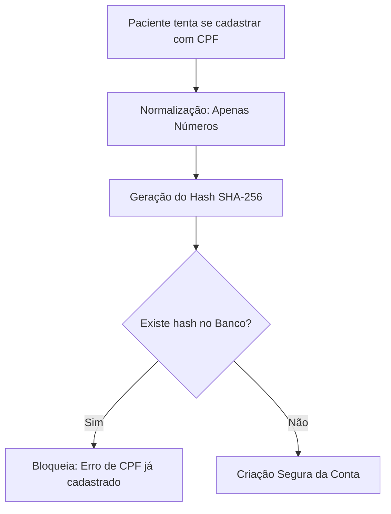

# 🗺️ Roadmap de Refatoração: Fluxo de Aprovação & Controle de Faltas

Este documento apresenta um plano técnico detalhado para a evolução do sistema de agendamentos do **Projeto Lucas**.

---

## 📌 Progresso do Projeto
* [x] **Fase 1: Fluxo de Aprovação de Consultas pelo Médico** *(Implementado)*
* [x] **Fase 2: Sistema de Advertência e Bloqueio Automático por Faltas (15 dias)** *(Implementado)*
* [ ] **Fase 3: Unicidade do CPF, Cadastro Seguro e Fim do Compartilhamento de Contas** *(Nova etapa)*

---

# 🚀 Fase 2: Sistema de Advertência e Bloqueio Automático por Faltas

Esta fase visa desencorajar o absenteísmo e os cancelamentos/reagendamentos fora do prazo (menos de 24h) através de um sistema progressivo de penalidades (Advertência $\rightarrow$ Bloqueio de 15 dias) com total visibilidade para o administrador.

*(Os detalhes técnicos da Fase 2 permanecem documentados abaixo para a sua execução sequencial).*

---

# 🔒 Fase 3: Unicidade do CPF, Cadastro Seguro e Fim do Compartilhamento de Contas

Esta fase foca em garantir que **cada conta represente um único paciente real** (inclusive dependentes e filhos), eliminando a partilha de contas e a possibilidade de agendar em nome de terceiros, essencial para a integridade dos prontuários médicos e conformidade com a LGPD.

### Desafio da Criptografia e a Solução de Engenharia:
Como o campo `cpf` é criptografado na tabela `patient` com um vetor de inicialização (IV) aleatório por questões de segurança, **o banco de dados armazena valores diferentes para o mesmo CPF**.
* **Solução:** Adicionaremos uma coluna chamada `cpf_hash` que armazenará o hash **SHA-256** do CPF normalizado (apenas números). Essa coluna será protegida por uma constraint `UNIQUE` e `NOT NULL` diretamente no banco de dados.



---

## 🛠️ Detalhamento Técnico: Fase 3

### Passo 1: Migração SQL do Banco de Dados (Flyway)
**Arquivo:** `V5__enforce_unique_cpf_hash.sql` (em [db/migration](file:///home/marcos/Applications/sistema_lucas/backend/src/main/resources/db/migration))
* **Ação:** Adicionar as colunas e as restrições de obrigatoriedade e unicidade.
* **Código SQL:**
  ```sql
  -- Torna o campo CPF original obrigatório no banco
  ALTER TABLE patient ALTER COLUMN cpf SET NOT NULL;

  -- Adiciona coluna para o hash do CPF (SHA-256 gera 64 caracteres hexadecimais)
  ALTER TABLE patient ADD COLUMN cpf_hash VARCHAR(64);

  -- NOTA: Se houver dados existentes em produção, calcula-se os hashes antes da constraint.
  -- Para uma base limpa/desenvolvimento:
  ALTER TABLE patient ADD CONSTRAINT unique_cpf_hash UNIQUE (cpf_hash);
  ALTER TABLE patient ALTER COLUMN cpf_hash SET NOT NULL;
  ```

---

### Passo 2: Atualização do Modelo no Backend
**Arquivo:** [Patient.java](file:///home/marcos/Applications/sistema_lucas/backend/src/main/java/com/sistema/lucas/model/Patient.java)
* **Ação A:** Adicionar o atributo `cpfHash` à entidade.
* **Ação B:** Atualizar o método `@PrePersist`/`@PreUpdate` (`normalizePatient()`) para gerar o hash SHA-256 do CPF higienizado de forma automática.
* **Código sugerido:**
  ```java
  @Column(name = "cpf_hash", unique = true, nullable = false)
  private String cpfHash;

  @PrePersist
  @PreUpdate
  public void normalizePatient() {
      if (this.cpf != null) {
          String c = this.cpf.replaceAll("[^0-9]", "");
          // CPF normalizado com máscara
          if (c.length() == 11) {
              this.cpf = c.substring(0, 3) + "." + c.substring(3, 6) + "." + c.substring(6, 9) + "-" + c.substring(9, 11);
          } else {
              this.cpf = c;
          }
          // Gera o hash SHA-256 do CPF limpo (sem pontos ou traço)
          this.cpfHash = gerarCpfHash(c);
      }
      // Outras normalizações (telefone, etc.)...
  }

  private String gerarCpfHash(String cleanCpf) {
      try {
          java.security.MessageDigest digest = java.security.MessageDigest.getInstance("SHA-256");
          byte[] hash = digest.digest(cleanCpf.getBytes(java.nio.charset.StandardCharsets.UTF_8));
          StringBuilder hexString = new StringBuilder();
          for (byte b : hash) {
              String hex = Integer.toHexString(0xff & b);
              if (hex.length() == 1) hexString.append('0');
              hexString.append(hex);
          }
          return hexString.toString();
      } catch (Exception e) {
          throw new RuntimeException("Erro interno ao gerar hash do CPF", e);
      }
  }
  ```

---

### Passo 3: Bloqueio Seguro de Cadastros Simultâneos
**Arquivo:** [PatientService.java](file:///home/marcos/Applications/sistema_lucas/backend/src/main/java/com/sistema/lucas/service/PatientService.java)
* **Ação:** Adicionar um bloco try-catch de persistência para capturar e tratar concorrências de inserção (tentativas de cadastro simultâneas com o mesmo CPF que passem pela validação lógica inicial).
* **Código sugerido:**
  ```java
  @Transactional
  public void create(PatientCreateDTO dto) {
      if (cpfExiste(dto.cpf())) {
          throw new RuntimeException("Erro: CPF já cadastrado.");
      }
      if (repository.existsByEmail(dto.email())) {
          throw new RuntimeException("Erro: Email já cadastrado.");
      }
      
      Patient patient = new Patient();
      patient.setName(dto.name());
      patient.setEmail(dto.email());
      patient.setPassword(passwordEncoder.encode(dto.password()));
      patient.setRole(Role.PATIENT);
      patient.setCpf(dto.cpf());
      
      try {
          repository.save(patient);
          repository.flush(); // Força a validação do banco dentro da transação
      } catch (org.springframework.dao.DataIntegrityViolationException e) {
          // Captura a violação de UNIQUE do cpf_hash ou do email
          throw new RuntimeException("Erro: Este CPF ou E-mail já está em uso por outra conta.");
      }
  }
  ```

---

### Passo 4: Fim do Agendamento em Nome de Terceiros
* **Remoção de Possibilidades na Interface**:
  - A interface de agendamento em [my-appointments.html](file:///home/marcos/Applications/sistema_lucas/frontend/src/app/pages/my-appointments/my-appointments.html) **já está protegida**: ela não possui campos para preenchimento de nome do paciente ou seleção de dependentes.
  - A lógica é rigidamente atrelada ao usuário autenticado (`Principal` no Backend). O DTO [AppointmentCreateDTO.java](file:///home/marcos/Applications/sistema_lucas/backend/src/main/java/com/sistema/lucas/model/dto/AppointmentCreateDTO.java) **não possui** e **não deve receber** o campo `patientId` de entrada nas requisições do paciente.

* **Diretriz de Negócio (Dependentes e Crianças)**:
  - Para o agendamento de filhos e dependentes, **cada um deve ter seu próprio login/cadastro com seu respectivo CPF** (visto que no Brasil, desde 2015, o CPF é emitido na própria certidão de nascimento). Isso assegura que o prontuário de evolução médica do menor fique isolado e atrelado estritamente ao seu histórico individual, evitando misturar informações clínicas de pais e filhos.

---

## 📈 Critérios de Aceite para Validação

1. **Tentativa de Duplicidade Simples**:
   - Cadastrar um paciente com o CPF `123.456.789-00`.
   - Tentar cadastrar um segundo paciente com o mesmo CPF `123.456.789-00` $\rightarrow$ O sistema deve retornar erro amigável de validação de CPF em uso.

2. **Tentativa Concorrente (Race Condition)**:
   - Duas requisições de cadastro idênticas com o mesmo CPF chegam à API simultaneamente.
   - Ambas passam pela validação lógica `cpfExiste()`.
   - A transação A salva primeiro $\rightarrow$ Sucesso.
   - A transação B tenta salvar $\rightarrow$ O banco dispara `ConstraintViolation` $\rightarrow$ O try-catch captura e retorna resposta amigável de erro de concorrência.

3. **Validação de Prontuário Limpo**:
   - Validar que na página de agendamento do paciente não haja nenhum checkbox do tipo "Agendar para dependente", forçando o login individual.
